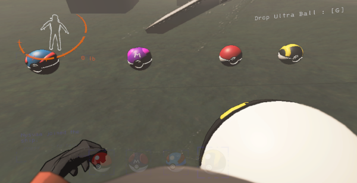

# LethalMon

LethalMon is a Lethal Company mod that includes the possibility to catch monsters and use them to help you.

This mod is not yet finished and so not available on the Thunderstore or elsewhere.

## How to catch monsters?

You have to find balls in the buildings and then send them to a monster with left click. For now, not all monsters are implemented and catchable. Please take a look at [Implemented monsters and behaviours](#implemented-monsters-and-behaviours)

Each ball has a different probability of success depending on the type of ball and the monster's type.

The stronger the monster is, the harder to catch it is. And be careful, if the catch fails, the ball disappears and the monster will want to kill you.

## Now that I caught one, what should I do?

You can throw the ball on the ground where you want the monster to appear.

To retrieve it, press P (not configurable for now).

If a player dies or disconnects, the monster will be called in the ball at it's location.

## Implemented monsters and behaviours

Here are the implementation status of monsters:

|      Monster      | Implemented |                      Behaviour                       |
|:-----------------:|:-----------:|:----------------------------------------------------:|
|      Bracken      |     WIP     |                         TBD                          |
|      Spider       |     No      |                         TBD                          |
|      Butler       |     No      |                         TBD                          |
|     Coil-head     |     No      |                         TBD                          |
|    Ghost Girl     |     No      |                         TBD                          |
|   Hoarding Bug    |     Yes     |     Brings items in a line of sight to the owner     |
|     Hygrodere     |     No      |                         TBD                          |
|      Jester       |     No      |                         TBD                          |
|      Masked       |     No      |                         TBD                          |
|    Nutcracker     |     No      |                         TBD                          |
|    Snare Flea     |     No      |                         TBD                          |
|   Spore Lizard    |     No      |                         TBD                          |
|      Thumper      |     No      |                         TBD                          |
|       Bees        |     Yes     | Stun monsters and damage players that hurt the owner |
|     Manticoil     |     No      |                         TBD                          |
|  Roaming Locusts  | Will not be |                          -                           |
|    Tulip Snake    |     No      |                         TBD                          |
|    Baboon Hawk    |     No      |                         TBD                          |
|  Earth Leviathan  |     No      |                         TBD                          |
|    Eyeless Dog    |     No      |                         TBD                          |
|   Forest Keeper   |     No      |                         TBD                          |
|     Old Bird      |     No      |                         TBD                          |
|   Mask Hornets    |     No      |                         TBD                          |

## Roadmap

Before first release:
- [ ] Audio
- [x] Show the real names of the monsters instead of the name in the code (e.g. Flowerman = Bracken)
- [ ] Bracken
- [x] Bees

In a future release:
- [ ] HUD
- [ ] Name above your own monsters
- [ ] Better (and working) tooltips
- [ ] Implementation of more monsters

Later:
- [ ] Better animations
- [ ] Config files